[](https://github.com/LOsioChico/LOsioChico/actions/workflows/waka.yml) [](https://github.com/LOsioChico/LOsioChico/actions/workflows/metrics.yml)

---

# My GitHub Stats 📈

|  |  |
| ------------------------- | -------------------------- |

---

# My WakaTime Stats 📊

<details>
<summary>Click here to expand ↩️</summary>
<br>

<!--START_SECTION:waka-->


**🐱 My GitHub Data** 

> 📦 682.6 kB Used in GitHub's Storage 
 > 
> 🏆 17 Contributions in the Year 2025
 > 
> 🚫 Not Opted to Hire
 > 
> 📜 28 Public Repositories 
 > 
> 🔑 32 Private Repositories 
 > 
**I'm a Night 🦉** 

```text
🌞 Morning                607 commits         ███░░░░░░░░░░░░░░░░░░░░░░   13.87 % 
🌆 Daytime                1374 commits        ████████░░░░░░░░░░░░░░░░░   31.41 % 
🌃 Evening                1498 commits        █████████░░░░░░░░░░░░░░░░   34.24 % 
🌙 Night                  896 commits         █████░░░░░░░░░░░░░░░░░░░░   20.48 % 
```
📅 **I'm Most Productive on Thursday** 

```text
Monday                   620 commits         ████░░░░░░░░░░░░░░░░░░░░░   14.17 % 
Tuesday                  655 commits         ████░░░░░░░░░░░░░░░░░░░░░   14.97 % 
Wednesday                489 commits         ███░░░░░░░░░░░░░░░░░░░░░░   11.18 % 
Thursday                 798 commits         █████░░░░░░░░░░░░░░░░░░░░   18.24 % 
Friday                   665 commits         ████░░░░░░░░░░░░░░░░░░░░░   15.20 % 
Saturday                 745 commits         ████░░░░░░░░░░░░░░░░░░░░░   17.03 % 
Sunday                   403 commits         ██░░░░░░░░░░░░░░░░░░░░░░░   09.21 % 
```


📊 **This Week I Spent My Time On** 

```text
💬 Programming Languages: 
Scala                    13 hrs 41 mins      █████████████████░░░░░░░░   67.35 % 
JavaScript               3 hrs 41 mins       █████░░░░░░░░░░░░░░░░░░░░   18.17 % 
Markdown                 1 hr 4 mins         █░░░░░░░░░░░░░░░░░░░░░░░░   05.29 % 
JSON                     54 mins             █░░░░░░░░░░░░░░░░░░░░░░░░   04.44 % 
Text                     15 mins             ░░░░░░░░░░░░░░░░░░░░░░░░░   01.28 % 
```

**I Mostly Code in TypeScript** 

```text
TypeScript               33 repos            █████████████░░░░░░░░░░░░   51.56 % 
Scala                    9 repos             ████░░░░░░░░░░░░░░░░░░░░░   14.06 % 
JavaScript               6 repos             ██░░░░░░░░░░░░░░░░░░░░░░░   09.38 % 
CSS                      5 repos             ██░░░░░░░░░░░░░░░░░░░░░░░   07.81 % 
Java                     2 repos             █░░░░░░░░░░░░░░░░░░░░░░░░   03.12 % 
```


 Last Updated on 16/04/2025 01:08:52 UTC
<!--END_SECTION:waka-->

## </details>
