[](https://github.com/LOsioChico/LOsioChico/actions/workflows/waka.yml) [](https://github.com/LOsioChico/LOsioChico/actions/workflows/metrics.yml)

---

# My GitHub Stats 📈

|  |  |
| ------------------------- | -------------------------- |

---

# My WakaTime Stats 📊

<details>
<summary>Click here to expand ↩️</summary>
<br>

<!--START_SECTION:waka-->


**🐱 My GitHub Data** 

> 📦 698.4 kB Used in GitHub's Storage 
 > 
> 🚫 Not Opted to Hire
 > 
> 📜 29 Public Repositories 
 > 
> 🔑 34 Private Repositories 
 > 
**I'm a Night 🦉** 

```text
🌞 Morning                699 commits         ████░░░░░░░░░░░░░░░░░░░░░   14.74 % 
🌆 Daytime                1528 commits        ████████░░░░░░░░░░░░░░░░░   32.23 % 
🌃 Evening                1610 commits        ████████░░░░░░░░░░░░░░░░░   33.96 % 
🌙 Night                  904 commits         █████░░░░░░░░░░░░░░░░░░░░   19.07 % 
```
📅 **I'm Most Productive on Thursday** 

```text
Monday                   646 commits         ███░░░░░░░░░░░░░░░░░░░░░░   13.63 % 
Tuesday                  738 commits         ████░░░░░░░░░░░░░░░░░░░░░   15.57 % 
Wednesday                557 commits         ███░░░░░░░░░░░░░░░░░░░░░░   11.75 % 
Thursday                 881 commits         █████░░░░░░░░░░░░░░░░░░░░   18.58 % 
Friday                   725 commits         ████░░░░░░░░░░░░░░░░░░░░░   15.29 % 
Saturday                 758 commits         ████░░░░░░░░░░░░░░░░░░░░░   15.99 % 
Sunday                   436 commits         ██░░░░░░░░░░░░░░░░░░░░░░░   09.20 % 
```


📊 **This Week I Spent My Time On** 

```text
💬 Programming Languages: 
SQL                      2 hrs 51 mins       █████████░░░░░░░░░░░░░░░░   35.88 % 
TypeScript               2 hrs 50 mins       █████████░░░░░░░░░░░░░░░░   35.60 % 
Astro                    1 hr 46 mins        ██████░░░░░░░░░░░░░░░░░░░   22.29 % 
YAML                     24 mins             █░░░░░░░░░░░░░░░░░░░░░░░░   05.07 % 
Other                    3 mins              ░░░░░░░░░░░░░░░░░░░░░░░░░   00.66 % 
```

**I Mostly Code in TypeScript** 

```text
TypeScript               33 repos            ████████████░░░░░░░░░░░░░   50.00 % 
Scala                    9 repos             ███░░░░░░░░░░░░░░░░░░░░░░   13.64 % 
JavaScript               7 repos             ███░░░░░░░░░░░░░░░░░░░░░░   10.61 % 
CSS                      5 repos             ██░░░░░░░░░░░░░░░░░░░░░░░   07.58 % 
Astro                    4 repos             ██░░░░░░░░░░░░░░░░░░░░░░░   06.06 % 
```


 Last Updated on 16/07/2025 01:16:42 UTC
<!--END_SECTION:waka-->

## </details>
